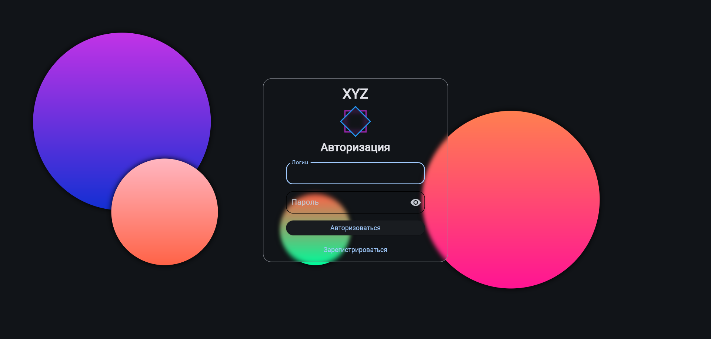
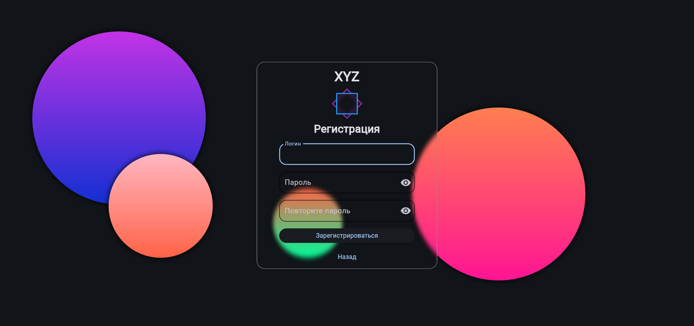

# 🛒 Ecommerce Promo Store (XYZ)

## 📌 Описание проекта
**XYZ** — это интернет-магазин для продажи промокодов.  
Проект использует **FastAPI** на backend и **Flet** на frontend для удобного взаимодействия.  

---

## 🚀 Функциональность
- 🏷️ **Создание и управление промокодами**
- 🛍️ **Добавление товаров и категорий**
- 👤 **Регистрация и аутентификация пользователей**
- 📦 **Оформление заказов**
- 📊 **Админ-панель для управления**
- ⚡ **Асинхронная работа с базой данных (PostgreSQL)**
- 🎨 **Интерактивный интерфейс на Flet**

---
## 📂 Скриншоты функционала

### ⚡️ Авторизация


### ⚡️ Регистрация


---
            
## 📂 Структура проекта
```plaintext
ecommerce_project/
│── backend/                # Серверная часть
│   ├── db/                 # База данных
│   │   ├── models/         # SQLAlchemy модели
│   │   ├── repository/     # Репозитории для работы с БД
│   │   ├── engine.py       # Подключение к БД
│   ├── fast_api/           # FastAPI API
│   │   ├── routers/        # Эндпоинты
│   │   ├── web_app.py      # Основной API файл
│   ├── utils/              # Утилиты
│── frontend/               # Клиентская часть (Flet)
│   ├── api/                # API-запросы
│   ├── pages/              # Интерфейсные страницы
│   ├── assets/             # Медиафайлы
│── .env                    # Файл конфигурации
│── requirements.txt        # Список зависимостей
│── README.md               # Описание проекта
```

---

## 🔧 Установка и запуск

### 1️⃣ Клонирование репозитория
```sh
git clone https://github.com/greido-crypt/ecommerce_project.git
cd ecommerce_project
```

### 2️⃣ Настройка окружения
```sh
python -m venv venv
source venv/bin/activate  # macOS/Linux
venv\Scripts\activate      # Windows
```

### 3️⃣ Установка зависимостей
```sh
pip install -r requirements.txt
```

### 4️⃣ Запуск сервера (FastAPI)
```sh
python -m backend.fast_api.main
```

### 5️⃣ Запуск фронтенда (Flet)
```sh
python -m frontend.main
```

---

## 🛠 Используемые технологии
- **FastAPI** — бекенд API
- **SQLAlchemy + asyncpg** — работа с PostgreSQL
- **Passlib + bcrypt** — хеширование паролей
- **Flet** — фронтенд на Python
- **Uvicorn** — ASGI сервер
- **dotenv** — хранение конфигурации

---

## 🤝 Контрибьютинг
Хотите помочь проекту```  

1. **Форкните** репозиторий.  
2. **Создайте новую ветку** (```sh git checkout -b feature-branch ```).  
3. **Добавьте изменения** и закоммитьте (```sh git commit -m "Добавлена новая фича" ```).  
4. **Запушьте** ветку (```sh git push origin feature-branch ```).  
5. **Создайте Pull Request**.  

---

## 📜 Лицензия
Этот проект распространяется под **MIT License**.  

---

## 📞 Контакты
Если у вас есть вопросы или предложения, свяжитесь со мной через GitHub.  

🚀 **Развивайте проект и используйте его на здоровье!** 😊
